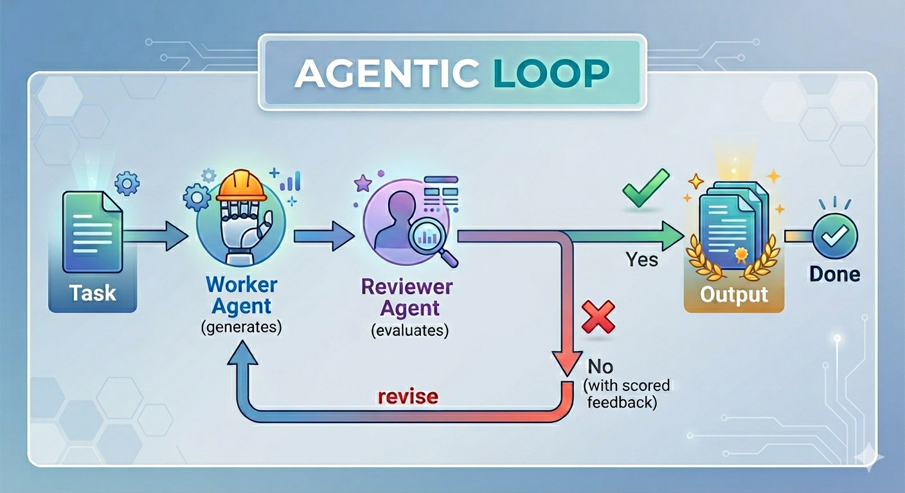

# Agentic Loop

**Self-refining AI through adversarial worker-reviewer collaboration.**

Agentic Loop is a lightweight orchestration framework that drives LLM outputs toward quality through structured iteration. A worker agent produces output, a reviewer agent evaluates it against defined criteria, and the loop continues — with full context preserved — until the work meets your standards.

The key insight: **the worker and reviewer can be different models with different weights.** Pair a lightweight model for fast generation with a heavier model for rigorous critique. Use Claude to review GPT's work. Mix local and cloud models. The mismatch in model sizes and architectures creates an adversarial dynamic — two models debating until the output is genuinely good, not just plausible.

---

## Why Agentic Loop?

Single-shot LLM calls are fragile. They produce output once and hope it's good enough. Real quality comes from iteration — draft, critique, revise, repeat.

Agentic Loop automates this workflow:

<p align="center">
  
</p>

- **No fresh restarts.** The full conversation history flows across every iteration. The worker remembers what it tried, what failed, and what the reviewer asked for.
- **Structured accountability.** The reviewer scores on a 0-10 scale with specific comments and action items. No vague "looks good."
- **Configurable rigor.** Set minimum iterations to force polish. Set score thresholds to block premature approval. Set maximum iterations as a safety cap.

## Cross-Model Review

This is where Agentic Loop stands apart. Most AI workflows use the same model to generate and self-evaluate — which is like grading your own exam.

Agentic Loop lets you assign **different models** to worker and reviewer roles:

```yaml
# task.md frontmatter
---
worker_model: openai      # Lightweight model generates drafts
reviewer_model: claude     # Different model holds the quality bar
---
```

**Why this matters:**

- **Different weights, better debate.** Models with different parameter sizes and architectures bring different perspectives. A smaller model might take shortcuts; a larger reviewer catches them. The mismatch is the feature.
- **Adversarial quality pressure.** A model reviewing another model's work catches errors that self-review misses. Different training data means different blind spots.
- **Honest evaluation.** A separate reviewer has no incentive to rubber-stamp its own output. It evaluates against the criteria you defined, not against what was convenient to produce.
- **Mix and match freely.** Pair any combination — local with cloud, Claude with GPT, two local models of different sizes. The framework is provider-agnostic.
- **Cost efficiency.** Use an inexpensive model for the heavy lifting of generation, and a premium model only for the lightweight review step.

## Features

- **Provider-agnostic** — Ollama (local), Anthropic Claude, OpenAI, or any OpenAI-compatible API
- **Cross-model review** — different models for worker and reviewer roles
- **Persistent context** — full conversation history across all iterations, no fresh restarts
- **Text and code output** — generates markdown documents, Python files, HTML apps, or any single-file deliverable
- **Configurable iteration bounds** — `min_reviews` forces polish, `max_reviews` prevents runaway loops
- **Score threshold gating** — `pass_threshold` blocks approval below a minimum quality score
- **Run history** — every execution creates a timestamped run directory; previous runs are never overwritten
- **Resumable** — interrupt mid-task and resume from the last completed iteration
- **Parallel execution** — run multiple tasks concurrently with configurable concurrency limits
- **Robust review parsing** — handles structured JSON, embedded JSON, letter grades, and free-text scores from any model

## Example Results

These example tasks are included in the repo and ran using Ollama (`gemma4:31b-cloud`):

| Task | Type | Iterations | Final Score | Description |
|------|------|-----------|-------------|-------------|
| Explain Agentic Loops | Text | 3 of 4 | 10/10 | 300-500 word explainer on agentic AI loops |
| CLI Calculator | Code | 2 of 4 | 9/10 | Python CLI calculator with input validation |

The text task approved early at 10/10 on iteration 1, was forced to continue by `min_reviews: 2`, dropped to 5/10 on the second review, then revised and finished at 10/10. The code task started at 6/10 and was revised to 9/10 — showing how the feedback loop catches and fixes issues automatically.

---

## Quick Start

### Prerequisites

- Python 3.11+
- An LLM provider

### Install

```bash
git clone https://github.com/2dmurali/agentic-loop.git
cd agentic-loop
python3 -m venv .venv
source .venv/bin/activate
pip install -e ".[dev]"
```

### Configure

Edit `config.yaml` to set your models:

```yaml
default_model: ollama

models:
  ollama:
    provider: ollama
    model_id: gemma4:31b-cloud
    base_url: http://localhost:11434/v1
    max_tokens: 32768

  claude:
    provider: claude
    api_key_env: ANTHROPIC_API_KEY
    model_id: claude-sonnet-4-20250514
    max_tokens: 4096

  openai:
    provider: openai
    api_key_env: OPENAI_API_KEY
    model_id: gpt-4o
    max_tokens: 4096
```

For cloud providers, set the API key:

```bash
export ANTHROPIC_API_KEY=sk-...
# or
export OPENAI_API_KEY=sk-...
```

### Create a Task

Each task is a folder under `tasks/` with a `task.md` file:

```markdown
# tasks/my-task/task.md
---
name: "Write a Python fibonacci function"
min_reviews: 2
max_reviews: 4
pass_threshold: 8.0
output_filename: fibonacci.py
---

## Worker Goal
Write a production-quality Python function that computes the Nth
Fibonacci number efficiently, along with comprehensive unit tests.

## Worker Instructions
- Implement an iterative approach for O(n) time complexity
- Handle edge cases: n=0, n=1, negative numbers
- Include type hints and a docstring
- Output ONLY the Python code

## Reviewer Criteria
- Correctness: Does it return the right Fibonacci numbers?
- Efficiency: Is it O(n) time and O(1) space?
- Edge cases: Are all edge cases handled?
- Code style: Are type hints and naming conventions proper?
```

### Run

```bash
# Validate task definitions (no LLM calls)
agentic-loop validate

# Run a specific task
agentic-loop run --task my-task

# Run all tasks
agentic-loop run

# Run tasks in parallel
agentic-loop run --parallel

# Resume an interrupted run
agentic-loop run --task my-task --resume

# Check task status
agentic-loop status
```

---

## Task Definition Reference

### Frontmatter Fields

| Field | Required | Default | Description |
|-------|----------|---------|-------------|
| `name` | No | folder name | Human-readable task name |
| `min_reviews` | No | 1 | Minimum iterations before approval is allowed |
| `max_reviews` | No | 5 | Maximum iterations (safety cap) |
| `pass_threshold` | No | none | Minimum reviewer score (0-10) required for approval |
| `output_filename` | No | `output.md` | Filename for the deliverable (e.g., `index.html`, `main.py`) |
| `worker_model` | No | config default | LLM model for the worker agent |
| `reviewer_model` | No | config default | LLM model for the reviewer agent |

### Required Markdown Sections

| Section | Purpose |
|---------|---------|
| `## Worker Goal` | What the worker should produce — the deliverable definition |
| `## Worker Instructions` | Detailed instructions, constraints, format requirements |
| `## Reviewer Criteria` | Evaluation dimensions, scoring guidance, rejection rules |

### Text vs Code Tasks

The `output_filename` field determines the task type:

- **Text tasks** (`output.md` default) — Worker output is saved as-is. Best for research, writing, analysis.
- **Code tasks** (`index.html`, `main.py`, etc.) — Worker is automatically instructed to output only the file content with no markdown wrapping. The deliverable is a ready-to-run file.

## Output Structure

Each run creates a timestamped directory preserving full history:

```
tasks/my-task/
├── task.md
└── output/
    ├── run-20260414-151143/
    │   ├── output/
    │   │   └── index.html          # The deliverable (evolves each iteration)
    │   ├── worker-v1.md            # Worker's first attempt (audit log)
    │   ├── review-v1.md            # Reviewer feedback
    │   ├── worker-v2.md            # Worker's revision
    │   ├── review-v2.md            # Reviewer feedback
    │   ├── context.json            # Full conversation state (for resume)
    │   └── summary.md              # Completion summary with score history
    ├── run-20260414-180510/        # Previous runs preserved
    │   └── ...
    └── latest -> run-20260414-180510
```

The `output/` subfolder inside each run contains the deliverable. Access the latest result at:
```
tasks/<task-name>/output/latest/output/<filename>
```

## Architecture

```
agentic-loop/
├── config.yaml              # Global configuration
├── tasks/                   # Task definitions
│   └── <task-name>/
│       └── task.md
├── src/
│   ├── cli.py               # CLI interface (Click)
│   ├── config.py            # Configuration loading and resolution
│   ├── context.py           # Context accumulator — preserves full history
│   ├── models.py            # Pydantic data models
│   ├── runner.py            # Core worker-reviewer loop orchestration
│   ├── task_loader.py       # Task definition parsing
│   └── llm/
│       ├── base.py          # Abstract LLM provider interface
│       ├── claude_provider.py
│       ├── openai_provider.py
│       └── factory.py       # Provider factory
└── tests/                   # 49 tests covering all modules
```

### Design Principles

- **Provider abstraction.** The LLM layer is a strategy pattern — swap providers without touching loop logic. Adding a new provider means implementing one `generate()` method.
- **Context preservation.** The `ContextAccumulator` maintains separate growing message histories for worker and reviewer, ensuring neither agent loses context across iterations.
- **Robust review parsing.** Three-strategy parser handles structured JSON, embedded JSON blocks, and free-text heuristics (numeric scores, letter grades, keyword detection). Works with any model's output format.

## Development

```bash
# Install with dev dependencies
pip install -e ".[dev]"

# Run tests
pytest tests/ -v

# Run a quick validation
agentic-loop validate
```

## Disclaimer

This project is for **knowledge and experimental purposes**. It demonstrates agentic AI patterns and iterative refinement workflows as a learning resource. The framework may require further refinement for production use — always review and validate generated outputs.

## License

MIT
